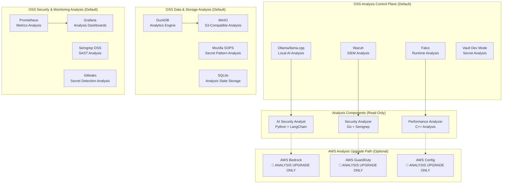

# ROSe (Read-Only Security) - Design Document

## Overview

**ROSe (Read-Only Security)** is a comprehensive analytical system that provides deep security insights, governance validation, and risk intelligence without autonomous remediation. ROSe operates in a strictly read-only capacity, generating human-readable recommendations and analysis reports while maintaining complete separation from production system modification.

The system operates on three core principles:
1. **Analysis-First Approach**: Every component focuses on observation, analysis, and recommendation rather than autonomous action
2. **Human-in-the-Loop Decision Making**: All recommendations require human review and approval before implementation
3. **Spec-Driven Governance**: All analysis follows structured specifications with comprehensive reporting

ROSe serves as an **intelligent cybersecurity observatory** that helps security architects, engineers, and analysts make informed decisions based on comprehensive analysis rather than automated enforcement.

## Architecture

ROSe is built as an **open-source cybersecurity analysis control plane** that runs locally by default, with optional AWS upgrade paths for enterprise scale. The core principle is **$0 monthly cost** with full local reproducibility and **read-only analytical operations**.



### OSS-First Analysis Control Plane Design

**Default OSS Analysis Stack (Zero Cost)**:
- **Ollama/llama.cpp**: Local AI model analysis and intelligence generation
- **Wazuh + Falco**: Comprehensive security event analysis and threat pattern detection
- **DuckDB + MinIO**: High-performance analytics and S3-compatible analysis storage
- **Prometheus + Grafana**: Metrics analysis, monitoring intelligence, and alerting analysis
- **Mozilla SOPS**: Secret pattern analysis and encryption assessment
- **Semgrep OSS**: Static application security analysis and vulnerability detection

**AWS Analysis Upgrade Paths (Optional)**:
- Clearly documented upgrade options for enterprise-scale analysis
- Cost warnings and budget caps for all paid analysis services
- Feature parity explanations between OSS and AWS analysis options

## Components and Interfaces

### 1. OSS-First AI Security Analysis (Python + Ollama)

**Primary OSS Stack**: Ollama, LangChain, SQLite
```python
# OSS DEFAULT: Ollama (local LLM analysis)
# UPGRADE OPTION: AWS Bedrock
# WHY UPGRADE: Managed scaling + compliance + enterprise SLA for analysis
# COST RISK: Token-based billing, no free tier

class OSSSecurityAnalyst:
    def __init__(self, ollama_endpoint="http://localhost:11434"):
        self.ollama_client = OllamaClient(ollama_endpoint)
        self.analysis_db = sqlite3.connect("analysis_context.db", mode="ro")  # Read-only
        self.vector_store = ChromaDB(persist_directory="./analysis_db")
    
    def analyze_repository(self, repo_path: str) -> SecurityAnalysisReport:
        # Uses local Ollama models for analysis, stores results in read-only SQLite
        pass
    
    def validate_sdd_compliance(self, artifacts: SDDArtifacts) -> ComplianceAnalysisReport:
        # Uses local rule engine with Ollama for natural language compliance analysis
        pass
    
    def analyze_security_patterns(self, codebase: str) -> SecurityPatternReport:
        # Uses local Ollama to analyze security patterns and generate recommendations
        pass
    
    def generate_fix_recommendations(self, violations: List[Violation]) -> List[TextualRecommendation]:
        # Generates human-readable fix recommendations (no code execution)
        pass
```

**Framework Integration**: LangChain with Ollama backend for analysis
- **Rationale**: LangChain provides comprehensive ecosystem, Ollama provides free local LLM analysis
- **Key Features**: 
  - Persistent analysis context using SQLite and ChromaDB (read-only)
  - SDD compliance analysis through local rule engine
  - Security pattern analysis with local models and recommendation generation

### 2. OSS-First Security Intelligence (Go + Wazuh + Falco)

**Primary OSS Stack**: Wazuh, Falco, Semgrep OSS, Gitleaks
```go
# OSS DEFAULT: Wazuh + Falco + Semgrep OSS (analysis only)
# UPGRADE OPTION: AWS GuardDuty + AWS Config
# WHY UPGRADE: Managed threat intel feeds + compliance reporting + enterprise analysis
# COST RISK: Per-event billing, enterprise features only

type OSSSecurityIntelligence interface {
    AnalyzeCodeWithSemgrep(ctx context.Context, codebase string) (*SemgrepAnalysisReport, error)
    AnalyzeSecretsWithGitleaks(ctx context.Context, content string) (*SecretAnalysisReport, error)
    AnalyzeEventsWithWazuh(ctx context.Context, events []SecurityEvent) (*ThreatIntelligenceReport, error)
    AnalyzeRuntimeWithFalco(ctx context.Context, logs []RuntimeLog) (*RuntimeAnalysisReport, error)
    GenerateRecommendations(ctx context.Context, findings []SecurityFinding) (*RecommendationReport, error)
}
```

**SAST Integration**: Semgrep OSS with analysis-focused extensions
- **Implementation**: Go microservice with local Semgrep binary for analysis, Wazuh for SIEM analysis, Falco for runtime analysis

### 3. OSS-First Performance Analysis (C++ + Local Analytics)

**Primary OSS Stack**: OpenSSL analysis, libsodium analysis, local cryptographic pattern analysis
```cpp
# OSS DEFAULT: OpenSSL + libsodium (analysis only)
# UPGRADE OPTION: AWS KMS + AWS Lambda Extensions
# WHY UPGRADE: Hardware security module analysis + managed key analysis
# COST RISK: Per-operation billing for KMS analysis

class OSSSecurityAnalyzer {
public:
    virtual SecurityPatternReport analyze_crypto_patterns(const std::string& codebase) = 0;
    virtual PerformanceAnalysisReport analyze_security_performance(const std::vector<uint8_t>& data) = 0;
    virtual ThreatAssessmentReport assess_threat_patterns(const std::vector<SecurityEvent>& events) = 0;
    virtual RecommendationReport generate_crypto_recommendations(const CryptoUsagePattern& patterns) = 0;
};
```

### 4. OSS-First Data Intelligence (DuckDB + MinIO)

**Primary OSS Stack**: DuckDB, MinIO, Mozilla SOPS
```python
# OSS DEFAULT: DuckDB + MinIO + SOPS (analysis only)
# UPGRADE OPTION: AWS Lake Formation + AWS Athena
# WHY UPGRADE: Cross-account enterprise analytics + petabyte scale analysis
# COST RISK: Query-based billing, storage costs

class OSSDataIntelligence:
    def __init__(self):
        self.duckdb = duckdb.connect("security_analysis.db", read_only=True)
        self.minio_client = MinioClient("localhost:9000", read_only=True)
        self.sops = SOPSAnalyzer()
    
    def analyze_access_patterns(self, access_logs: List[AccessLog]) -> AccessPatternReport:
        # Uses DuckDB for read-only access pattern analysis
        pass
    
    def analyze_data_governance(self, data_assets: List[DataAsset]) -> GovernanceAnalysisReport:
        # Uses DuckDB for governance compliance analysis
        pass
    
    def generate_policy_recommendations(self, current_policies: List[Policy]) -> PolicyRecommendationReport:
        # Generates human-readable policy improvement recommendations
        pass
```

## Data Models

### OSS-First Project Context Model
```python
@dataclass
class OSSProjectContext:
    repo_structure: Dict[str, FileMetadata]
    git_history: List[CommitInfo]
    dependencies: List[Dependency]
    security_posture: SecurityAssessment
    compliance_status: LocalComplianceStatus
    ollama_model_config: OllamaModelConfiguration
    local_permissions: LocalPermissionSet
    prometheus_metrics: PrometheusMetrics
    
    # Optional AWS upgrade fields
    aws_config_compliance: Optional[AWSConfigComplianceStatus] = None
    bedrock_model_config: Optional[BedrockModelConfiguration] = None

# OSS DEFAULT: Local SQLite + file storage
# UPGRADE OPTION: AWS DynamoDB + S3
# WHY UPGRADE: Multi-region replication + managed backups
# COST RISK: Storage and request-based billing
```

### OSS-Integrated Security Event Model
```python
@dataclass
class OSSSecurityEvent:
    event_id: str
    timestamp: datetime
    event_type: SecurityEventType
    severity: SeverityLevel
    source_component: str
    wazuh_rule_id: Optional[str]  # Wazuh SIEM rule that triggered
    falco_rule_name: Optional[str]  # Falco runtime rule
    semgrep_rule_id: Optional[str]  # Semgrep SAST rule
    local_audit_log: str  # Local file-based audit trail
    details: Dict[str, Any]
    remediation_actions: List[LocalRemediationAction]
    
    # Optional AWS upgrade fields
    cloudtrail_event_id: Optional[str] = None
    guardduty_finding_id: Optional[str] = None

# OSS DEFAULT: Wazuh + Falco + local logging
# UPGRADE OPTION: AWS GuardDuty + CloudTrail
# WHY UPGRADE: Managed threat intel + compliance reporting
# COST RISK: Per-event and storage billing
```

### OSS Data Asset Model
```python
@dataclass
class OSSDataAsset:
    minio_bucket: str
    duckdb_table: str
    local_file_path: str
    sops_encryption_key: str
    access_tags: List[LocalTag]
    local_policies: List[LocalPolicy]
    data_classification: DataClassification
    access_audit_trail: List[LocalDataAccess]
    
    # Optional AWS upgrade fields
    lake_formation_resource_arn: Optional[str] = None
    s3_location: Optional[str] = None
    kms_key_id: Optional[str] = None

# OSS DEFAULT: MinIO + DuckDB + SOPS
# UPGRADE OPTION: AWS Lake Formation + S3 + KMS
# WHY UPGRADE: Cross-account governance + enterprise compliance
# COST RISK: Storage, query, and encryption operation costs
```

## Correctness Properties

*A property is a characteristic or behavior that should hold true across all valid executions of a system—essentially, a formal statement about what the system should do. Properties serve as the bridge between human-readable specifications and machine-verifiable correctness guarantees.*

### Property Reflection

After analyzing all acceptance criteria, several properties can be consolidated to eliminate redundancy:

- Properties 2.7, 2.8, and 2.9 all relate to data safety and can be combined into comprehensive data protection properties
- Properties 7.1, 7.2, 7.3 about technology stack choices can be consolidated into technology compliance properties
- Properties 8.2, 8.3, 8.6 about documentation and setup can be combined into deployment completeness properties

### Core Properties

**Property 1: Repository Context Persistence**
*For any* repository analysis operation, the system should maintain complete context including repo structure, git history, and dependencies that persists across multiple operations
**Validates: Requirements 1.1**

**Property 2: SDD Artifact Generation**
*For any* feature implementation request, the agent should generate all three required SDD artifacts (requirements.md, design.md, tasks.md) with proper structure and content
**Validates: Requirements 1.2**

**Property 3: Steering File Compliance**
*For any* code change and steering file policy, the system should correctly identify compliance violations and approvals according to the policy rules
**Validates: Requirements 1.3**

**Property 4: Analysis-Based Fix Recommendations**
*For any* detected SDD deviation, the analyst should generate appropriate textual fix recommendations that address the violation without executing any changes
**Validates: Requirements 1.4**

**Property 5: Security Pattern Analysis**
*For any* analyzed code, it should identify security patterns and anti-patterns, generating comprehensive security posture assessments with recommendations
**Validates: Requirements 1.5**

**Property 6: Analysis-Driven Security Scanning**
*For any* file analysis operation, SAST scans should be automatically triggered and generate comprehensive security analysis reports within defined time limits
**Validates: Requirements 2.1**

**Property 7: Test Coverage Analysis**
*For any* code change analysis, the system should identify test coverage gaps and generate appropriate test strategy recommendations
**Validates: Requirements 2.2**

**Property 8: Documentation Analysis and Recommendations**
*For any* API change analysis, all related documentation gaps should be identified and synchronization recommendations should be generated
**Validates: Requirements 2.3**

**Property 9: Secret Detection and Analysis**
*For any* content analysis containing secret patterns (API keys, passwords, tokens), the system should detect and report the findings with remediation recommendations
**Validates: Requirements 2.4**

**Property 10: Comprehensive Data Protection**
*For any* system operation involving credentials, logging, or sample data, the system should enforce secure credential loading, automatic PII redaction, and synthetic-only datasets
**Validates: Requirements 2.7, 2.8, 2.9**

**Property 11: Access Pattern Analysis**
*For any* user access analysis request, the system should analyze patterns and generate least-privilege configuration recommendations
**Validates: Requirements 2.5**

**Property 12: Blast Radius Assessment**
*For any* service deployment analysis, the system should assess sandboxing effectiveness, service dependencies, and region restrictions to generate containment recommendations
**Validates: Requirements 2.6**

**Property 13: Shadow Mode Risk Analysis**
*For any* proposed code or infrastructure change, it should be analyzed in an isolated shadow environment and generate comprehensive risk assessments
**Validates: Requirements 3.1**

**Property 14: Reliability Intelligence Analysis**
*For any* system metrics indicating issues, appropriate analysis should be performed and reliability intelligence reports should be generated with recommended actions
**Validates: Requirements 3.2**

**Property 15: Automated Incident Analysis**
*For any* simulated or real incident, the system should perform root cause analysis and generate comprehensive hypothesis reports with recommended response procedures
**Validates: Requirements 3.3, 3.5**

**Property 16: Performance Pattern Analysis**
*For any* performance metrics and usage patterns, the system should analyze trends and generate scaling recommendations with cost and performance trade-offs
**Validates: Requirements 3.4**

**Property 17: Input Security Validation**
*For any* user input, prompt injection attempts and malicious content should be detected and filtered before processing
**Validates: Requirements 4.1**

**Property 18: Dependency Security Verification**
*For any* dependency addition or update, security scanning should be performed and vulnerabilities should be reported or blocked
**Validates: Requirements 4.2**

**Property 19: Package Validation**
*For any* package installation request, it should be validated against allow lists to prevent typosquatting and unauthorized packages
**Validates: Requirements 4.3**

**Property 20: AI Output Validation**
*For any* AI-generated output, validation mechanisms should detect and mitigate hallucinations or inappropriate content
**Validates: Requirements 4.4**

**Property 21: Threat Model Generation**
*For any* threat modeling request, the system should identify security risks, prioritize them, and provide appropriate mitigation strategies
**Validates: Requirements 4.5**

**Property 22: Data Access Control**
*For any* data access request, tag-based or policy-driven access controls should be properly applied and enforced
**Validates: Requirements 5.2, 5.4**

**Property 23: Cross-Account Access Patterns**
*For any* cross-account data access requirement, zero-copy patterns should be implemented where technically feasible
**Validates: Requirements 5.3**

**Property 24: Policy Propagation**
*For any* data policy change, access controls should be automatically updated across all affected data sources consistently
**Validates: Requirements 5.5**

**Property 25: Technology Stack Compliance**
*For any* system component, it should use only approved technologies (Python for AI, Go for microservices, C++ for performance-critical security, approved AWS services, approved CI/CD platforms)
**Validates: Requirements 7.1, 7.2, 7.3, 7.4, 7.5, 7.6**

**Property 26: Free-Tier Resource Usage**
*For any* system deployment, all services should operate within AWS free-tier limits or use open-source alternatives exclusively
**Validates: Requirements 8.1**

**Property 27: Deployment Self-Sufficiency**
*For any* system deployment, it should complete successfully using only AWS credentials and automatically install all dependencies
**Validates: Requirements 8.4, 8.5**

**Property 28: Complete Documentation and Setup**
*For any* system installation, all required SDD files, steering files, automation scripts, and documentation should be present and functional
**Validates: Requirements 8.2, 8.3, 8.6**

## GitHub Safety and Data Protection (MANDATORY)

### Automatic Secret Detection and Prevention

**Pre-Commit Protection**:
```bash
# Required git hooks configuration
git config --global core.hooksPath .githooks

# Pre-commit hook with gitleaks
#!/bin/bash
gitleaks detect --source . --verbose --redact
if [ $? -ne 0 ]; then
    echo "🚫 BLOCKED: Secrets detected in commit"
    echo "Run 'gitleaks detect' to identify and remove secrets"
    exit 1
fi
```

**Strict .gitignore Enforcement**:
```gitignore
# Credentials and secrets (NEVER COMMIT)
.env
.env.*
*.key
*.pem
*.p12
credentials.json
aws_credentials
config.json
secrets.yaml

# Personal data (NEVER COMMIT)
*.csv
*.xlsx
user_data/
personal/
emails.txt
contacts/

# Local development
.vscode/settings.json
.idea/
*.local
```

### Automatic Log Redaction

**PII and Secret Redaction Engine**:
```python
class LogRedactor:
    REDACTION_PATTERNS = [
        r'AKIA[0-9A-Z]{16}',  # AWS Access Keys
        r'[A-Za-z0-9+/]{40}',  # AWS Secret Keys
        r'[a-zA-Z0-9._%+-]+@[a-zA-Z0-9.-]+\.[a-zA-Z]{2,}',  # Emails
        r'\b(?:\d{1,3}\.){3}\d{1,3}\b',  # IP Addresses
        r'\b\d{3}-\d{2}-\d{4}\b',  # SSN patterns
        r'password["\s]*[:=]["\s]*[^"\s]+',  # Password fields
        r'token["\s]*[:=]["\s]*[^"\s]+',  # Token fields
    ]
    
    def redact_log(self, log_message: str) -> str:
        for pattern in self.REDACTION_PATTERNS:
            log_message = re.sub(pattern, '[REDACTED]', log_message, flags=re.IGNORECASE)
        return log_message
```

### Synthetic Data Only Policy

**Mock Data Generation**:
```python
# OSS DEFAULT: Python Faker for all test data
# UPGRADE OPTION: AWS synthetic data services
# WHY UPGRADE: Enterprise-scale synthetic data generation
# COST RISK: Data generation and storage costs

from faker import Faker
fake = Faker()

class SyntheticDataGenerator:
    def generate_user_data(self, count: int) -> List[Dict]:
        return [
            {
                "user_id": fake.uuid4(),
                "email": fake.email(),
                "name": fake.name(),
                "ip_address": fake.ipv4_private(),  # Only private IPs
                "created_at": fake.date_time_this_year()
            }
            for _ in range(count)
        ]
    
    def validate_no_real_data(self, dataset: Any) -> bool:
        # Validate that dataset contains only synthetic data
        # Block any real emails, names, or identifiers
        pass
```

## Error Handling

### Error Categories and Responses

**OSS Security Violations**:
- **Secret Detection**: Gitleaks blocking with clear remediation instructions
- **Policy Violations**: Local rule engine rollback with compliance guidance  
- **Access Violations**: Wazuh logging and alerting with local audit trail

**OSS System Failures**:
- **Service Unavailability**: Local service restart with Docker Compose health checks
- **Resource Exhaustion**: Prometheus alerting with local scaling recommendations
- **Data Corruption**: Local backup restoration with integrity verification using DuckDB

**OSS AI Agent Errors**:
- **Hallucination Detection**: Local output validation with human review escalation
- **Context Loss**: Automatic context reconstruction from SQLite storage
- **Generation Failures**: Fallback to template-based generation with manual review

**OSS Integration Failures**:
- **Ollama Model Issues**: Automatic model switching with local model management
- **MinIO Storage Issues**: Local backup storage with filesystem fallback
- **Network Issues**: Offline mode capabilities with local caching

# OSS DEFAULT: Local error handling and recovery
# UPGRADE OPTION: AWS managed services with SLA guarantees
# WHY UPGRADE: Enterprise SLA + managed recovery + 24/7 support
# COST RISK: Support costs + managed service premiums

**AWS-Native Recovery Mechanisms (Upgrade Only)**:
- **AWS Step Functions**: Orchestrate complex recovery workflows with built-in retry and error handling
- **AWS Lambda**: Serverless recovery functions triggered by CloudWatch alarms
- **AWS Config**: Automatic compliance remediation through Config rules and Lambda functions
- **AWS Systems Manager**: Automated patching and configuration management for recovery

### Recovery Mechanisms

All error scenarios include:
1. **Immediate Response**: Stop unsafe operations, preserve system state
2. **Diagnosis**: Automated root cause analysis with detailed logging
3. **Recovery**: Automated remediation where safe, manual escalation otherwise
4. **Prevention**: Update policies and monitoring to prevent recurrence

## Testing Strategy

### Dual Testing Approach

The system requires both unit testing and property-based testing for comprehensive coverage:

**Unit Tests**:
- Specific examples demonstrating correct behavior
- Edge cases and error conditions
- Integration points between components
- Mock data scenarios and boundary conditions

**Property-Based Tests**:
- Universal properties that hold for all inputs
- Comprehensive input coverage through randomization
- Validation of correctness properties defined above
- Minimum 100 iterations per property test

### Property-Based Testing Configuration

**Framework Selection**: 
- **Python**: Hypothesis for AI orchestration components
- **Go**: Go-fuzz and testing/quick for microservices
- **C++**: Catch2 with property-based extensions for security modules

**Test Configuration**:
- Minimum 100 iterations per property test
- Each property test references its design document property
- Tag format: **Feature: rose-read-only-security, Property {number}: {property_text}**
- Automated execution in CI/CD pipeline with failure blocking

**Coverage Requirements**:
- All 28 correctness properties must have corresponding property-based tests
- Unit tests should achieve 90%+ code coverage for critical security components
- Integration tests should cover all major component interactions
- End-to-end tests should validate complete user workflows

### OSS-First Testing Infrastructure

**OSS-Powered Shadow Mode Testing**:
- **Docker Compose**: Automated deployment pipelines with shadow environment provisioning
- **Local Git Hooks**: Pre-commit validation and shadow environment testing
- **Prometheus**: Performance monitoring and metrics collection for shadow mode
- **Local Rule Engine**: Compliance validation in shadow environments before production

# OSS DEFAULT: Docker Compose + Git hooks + Prometheus
# UPGRADE OPTION: AWS CodePipeline + CloudFormation + X-Ray
# WHY UPGRADE: Multi-region deployment + managed CI/CD + distributed tracing
# COST RISK: Build minutes + deployment costs + tracing charges

**OSS-Integrated Continuous Security Testing**:
- **GitHub Actions**: SAST scans using Semgrep OSS in free CI/CD
- **Wazuh**: Automated vulnerability assessments for deployed applications
- **Falco**: Continuous runtime threat detection with custom rules
- **Gitleaks**: Automated secret detection in CI/CD pipeline with pre-commit hooks

# OSS DEFAULT: GitHub Actions (free tier) + Wazuh + Falco + Gitleaks
# UPGRADE OPTION: AWS CodeBuild + Inspector + GuardDuty + Secrets Manager
# WHY UPGRADE: Managed scanning + compliance reporting + enterprise integrations
# COST RISK: Build minutes + scan costs + per-finding charges

**OSS Mock Data Strategy**:
- **Python Faker**: Synthetic data generation for testing scenarios
- **DuckDB**: Query validation against synthetic datasets with local analytics
- **Local File System**: Tag-based access control testing with synthetic user personas
- **Local Audit Logs**: Audit trail validation for all mock data operations

# OSS DEFAULT: Python Faker + DuckDB + local filesystem
# UPGRADE OPTION: AWS Glue + Athena + Lake Formation + CloudTrail
# WHY UPGRADE: Petabyte-scale synthetic data + cross-account testing + managed audit
# COST RISK: Query costs + storage costs + audit log charges