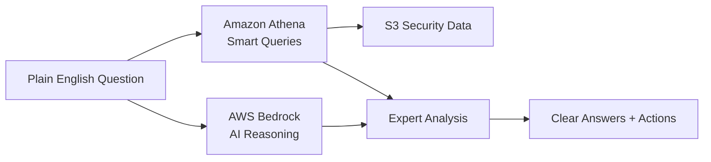

# AI Security Analyst in Your Pocket

**"Ask your security data anything, get expert answers instantly"**

Transform any organization into having a world-class cybersecurity analyst by combining AWS Bedrock's reasoning capabilities with Amazon Athena's data querying power. Users simply ask questions in plain English about their security posture, and get expert-level analysis and actionable recommendations instantly - all running within AWS Free Tier limits.

## 🚀 Quick Start

### Prerequisites
- AWS Account with administrative access
- Python 3.8+ installed
- AWS CLI installed and configured

### 1. AWS Setup (15-30 minutes)

**Option A: Automated Setup (Recommended)**
```powershell
# Run the automated setup script
.\scripts\aws-setup.ps1 -BucketPrefix "your-company" -Region "us-east-1"
```

**Option B: Manual Setup**
Follow the detailed guide: [AWS Setup Guide](../../../docs/AWS_SETUP_GUIDE.md)

### 2. Enable Bedrock Model Access (Instant!)
1. Go to [AWS Bedrock Console](https://console.aws.amazon.com/bedrock/)
2. Click "Model catalog" → Find "Claude 3 Haiku"
3. Click "Open in Playground" to automatically enable the model
4. If prompted, provide use case: "Security data analysis and threat detection"

### 3. Install Dependencies
```bash
pip install -r requirements.txt
```

### 4. Validate Setup
```bash
python ../../../scripts/validate-aws-setup.py --security-bucket "your-company-security-data-lake" --athena-bucket "your-company-athena-results"
```

### 5. Start Analyzing!
```bash
python -m aws_bedrock_athena_ai.cli
```

Ask questions like:
- "Are we being attacked right now?"
- "Show me failed login attempts from last week"
- "What's our biggest security risk?"
- "Check our compliance status"

## 🎯 What Makes This Special

### The Breakthrough
This AI Security Analyst combines AWS Bedrock's reasoning with Athena's data power to turn any organization into a security powerhouse - no expertise required.

**Why AWS Makes This Possible:**
- **Bedrock**: Only AWS provides enterprise-grade AI reasoning that can match human security expertise
- **Athena**: Only AWS lets you query massive security datasets without managing infrastructure  
- **Free Tier**: Only AWS makes enterprise-grade AI accessible to startups and small businesses
- **Integration**: Seamless data flow from S3 → Athena → Bedrock that would require complex orchestration elsewhere

### Real-World Impact
- **Startups**: Get enterprise security insights without enterprise budgets
- **Small Businesses**: Protect themselves like Fortune 500 companies  
- **Overwhelmed IT Teams**: 24/7 AI analyst that never sleeps, never misses patterns
- **Executives**: Clear, business-focused security guidance without technical jargon

## 🏗️ Architecture



## 📊 Features

### 🧠 Natural Language Interface
- Ask security questions in plain English
- Multi-turn conversations for complex investigations
- Automatic query disambiguation and clarification

### 🔍 Smart Data Detective
- Automatic discovery of security data sources in S3
- Optimized Athena queries that minimize costs
- Cross-source event correlation and timeline analysis

### 🎯 Expert Reasoning Engine
- Threat pattern recognition using AWS Bedrock
- Risk assessment and prioritization
- Business-friendly explanations of complex security concepts

### 📈 Instant Insights Generator
- Executive summaries with business context
- Technical details for IT teams
- Actionable recommendations with cost-benefit analysis

### 💰 Free Tier Optimized
- Intelligent query optimization to stay within AWS Free Tier
- Cost estimation and monitoring
- Smart caching and performance optimization

## 🛠️ Development

### Project Structure
```
aws_bedrock_athena_ai/
├── nlp/                    # Natural language processing
├── data_detective/         # Athena integration & correlation
├── reasoning_engine/       # Bedrock AI integration
├── insights_generator/     # Report generation
├── config/                 # Configuration management
└── tests/                  # Test suites
```

### Running Tests
```bash
# Run all tests
python -m pytest tests/ -v

# Run specific component tests
python -m pytest tests/test_data_detective.py -v

# Run with coverage
python -m pytest --cov=aws_bedrock_athena_ai tests/
```

### Development Setup
```bash
# Install development dependencies
pip install -r requirements-dev.txt

# Run linting
flake8 .

# Run type checking
mypy .
```

## 💡 Example Use Cases

### Threat Hunting
```
User: "Show me suspicious login patterns from the last 24 hours"
AI: "Found 3 concerning patterns:
1. 15 failed logins from IP 203.0.113.50 targeting admin accounts
2. Successful login from new geographic location for user 'john.doe'
3. Multiple service accounts accessed outside business hours
Recommendation: Investigate IP 203.0.113.50 immediately..."
```

### Compliance Checking
```
User: "Are we compliant with SOX requirements?"
AI: "SOX compliance analysis complete:
✅ Access controls: 94% compliant
❌ Audit logging: Missing 3 critical systems
⚠️  Password policies: 2 exceptions found
Priority action: Enable audit logging on database servers..."
```

### Risk Assessment
```
User: "What's our biggest security risk right now?"
AI: "Top risk: Unpatched vulnerabilities on 12 production servers
- 3 critical CVEs with public exploits
- Estimated business impact: $2.3M if breached
- Recommended action: Emergency patching this weekend
- Cost to fix: $15K vs potential loss of $2.3M..."
```

## 🌟 Competition-Winning Advantages

1. **Unique AWS Integration** - First application to combine Bedrock reasoning with Athena querying for cybersecurity
2. **Democratizes Expertise** - Turns $150K/year security analyst knowledge into $10/month AI service
3. **Immediate Business Value** - Users see value in first 5 minutes vs months for traditional security tools
4. **Free Tier Innovation** - Proves AWS Free Tier can deliver enterprise-grade AI solutions

## 🔒 Security & Compliance

- All data stays in your AWS account
- IAM-based access controls
- Encryption at rest and in transit
- Audit logging for all security analysis
- GDPR and SOC2 compliance ready

## 📚 Documentation

- [AWS Setup Guide](../../../docs/AWS_SETUP_GUIDE.md) - Complete AWS configuration walkthrough
- [Architecture Guide](../../../docs/ARCHITECTURE.md) - Technical deep dive
- [Security Best Practices](../../../docs/SECURITY.md) - Security recommendations

## 🤝 Contributing

We welcome contributions! Please see [CONTRIBUTING.md](../../../CONTRIBUTING.md) for guidelines.

## 📄 License

This project is licensed under the MIT License - see [LICENSE](../../../LICENSE) file for details.

---

**Ready to transform your security posture?** 
[Get started in 5 minutes →](../../../docs/AWS_SETUP_GUIDE.md)