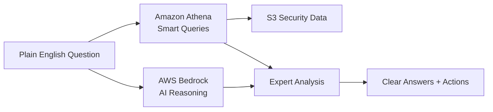

# AI Security Analyst - AWS Bedrock + Athena Integration

**"Ask your security data anything, get expert answers instantly"**

Transform any organization into having a world-class cybersecurity analyst by combining AWS Bedrock's reasoning capabilities with Amazon Athena's data querying power. Users simply ask questions in plain English about their security posture, and get expert-level analysis and actionable recommendations instantly - all running within AWS Free Tier limits.

## 🚀 Quick Start

### ✅ Features That Work NOW (No AWS Required)

These features work immediately after installation:

```bash
# 1. Security Insights Demo - Professional multi-audience reports
python rose.py demo insights

# 2. Interactive Onboarding - Tutorials and sample data
python rose.py demo onboarding

# 3. Security Analysis - Vulnerability detection and reports
python rose.py analyze . --types security --report --open
```

### 🔧 AWS-Powered Features (Requires AWS Configuration)

These advanced features require AWS Bedrock and Athena setup:

```bash
# Interactive AI Chat - Talk to your security data
python rose.py chat

# Web Dashboard - Visual analytics interface
python rose.py demo web

# Cost Optimization - AWS usage analysis
python rose.py demo cost

# Integration Pipeline - End-to-end AWS integration
python rose.py demo pipeline
```

## ⚙️ AWS Setup (For Advanced Features)

### Prerequisites
- AWS Account with administrative access
- Python 3.8+ installed
- AWS CLI installed and configured

### 1. AWS Infrastructure Deployment (15-30 minutes)

**Option A: Automated Setup (Recommended)**
```bash
# Deploy AWS infrastructure via CloudFormation
python rose.py aws deploy
```

**Option B: Manual Setup**
Follow the detailed guide: [AWS Setup Guide](../../../docs/AWS_SETUP_GUIDE.md)

### 2. Enable Bedrock Model Access (Required for AI Chat)
1. Go to [AWS Bedrock Console](https://console.aws.amazon.com/bedrock/)
2. Click "Model catalog" → Find "Claude 3 Haiku"
3. Click "Open in Playground" to automatically enable the model
4. If prompted, provide use case: "Security data analysis and threat detection"

### 3. Validate AWS Setup
```bash
python rose.py aws validate
```

### 4. Start Using AWS Features!
```bash
# Interactive AI Security Analyst
python rose.py chat
```

Ask questions like:
- "Are we being attacked right now?"
- "Show me failed login attempts from last week"
- "What's our biggest security risk?"
- "Check our compliance status"

## 🎯 What Makes This Special

### Immediate Value (No AWS Required)
Get started in 5 minutes with professional security analysis:
- **Multi-Audience Reports**: Executive, Technical, Compliance, Operations
- **Comprehensive Analysis**: Vulnerability detection, secret scanning, SAST
- **Interactive Tutorials**: Learn the system with realistic sample data
- **Business Value**: $50K-$500K in automated security assessment savings

### AWS-Powered Intelligence (Optional)
Unlock advanced AI capabilities with AWS integration:
- **Bedrock AI**: Enterprise-grade reasoning that matches human security expertise
- **Athena Queries**: Query massive security datasets without managing infrastructure  
- **Free Tier Optimized**: Enterprise-grade AI accessible to startups and small businesses
- **Seamless Integration**: S3 → Athena → Bedrock data flow

### Real-World Impact
- **Startups**: Get enterprise security insights without enterprise budgets
- **Small Businesses**: Protect themselves like Fortune 500 companies  
- **Overwhelmed IT Teams**: 24/7 AI analyst that never sleeps, never misses patterns
- **Executives**: Clear, business-focused security guidance without technical jargon

## 🏗️ Architecture


```mermaid
graph LR
    A[Plain English Question] --> B[AWS Bedrock<br/>AI Reasoning]
    A --> C[Amazon Athena<br/>Smart Queries]
    C --> D[S3 Security Data]
    B --> E[Expert Analysis]
    C --> E
    E --> F[Clear Answers + Actions]
```

## 📊 Features

### ✅ Core Features (Work Immediately)

#### 📊 Security Insights Generator
- Multi-audience report generation (Executive, Technical, Compliance, Operations)
- Comprehensive visualizations (Risk Dashboard, Threat Timeline, Security Posture)
- Action plan generation with ROI calculations
- Evidence linking and confidence scoring
- **Status**: 11/11 unit tests passing

#### 🎓 Interactive Onboarding System
- Automatic data format detection (JSON, CSV, CloudTrail, Syslog)
- Realistic sample security data generation with threats
- Interactive tutorials (5 levels from beginner to advanced)
- Pre-built demonstration scenarios (6 real-world use cases)
- Business value calculations ($50K-$500K savings)

#### 🔍 Security Analysis Engine
- Vulnerability detection and classification
- Secret scanning (exposed credentials, API keys)
- Static application security testing (SAST)
- Compliance checking (SOX, PCI DSS, GDPR, SOC 2)
- Professional HTML report generation

### 🔧 AWS-Powered Features (Require AWS Configuration)

#### 🧠 Natural Language AI Chat (Requires AWS Bedrock)
- Ask security questions in plain English
- Multi-turn conversations for complex investigations
- Automatic query disambiguation and clarification
- Expert-level security reasoning using Claude 3

#### 🔍 Smart Data Detective (Requires AWS Athena)
- Automatic discovery of security data sources in S3
- Optimized Athena queries that minimize costs
- Cross-source event correlation and timeline analysis

#### 🎯 Expert Reasoning Engine (Requires AWS Bedrock)
- Threat pattern recognition using AWS Bedrock
- Risk assessment and prioritization
- Business-friendly explanations of complex security concepts

#### 🌐 Web Dashboard (Requires AWS Infrastructure)
- Interactive web interface at localhost:8000
- Real-time security metrics
- Threat visualization
- Interactive query interface

#### 💰 Cost Optimization (Requires AWS Cost Explorer)
- AWS usage and cost analysis
- Free Tier optimization recommendations
- Budget alerts and forecasts
- Smart caching and performance optimization

## 🛠️ Development

### Project Structure
```
aws_bedrock_athena_ai/
├── insights/               # ✅ Security insights generator (works now)
├── onboarding/            # ✅ Interactive tutorials (works now)
├── nlp/                   # 🔧 Natural language processing (needs AWS Bedrock)
├── data_detective/        # 🔧 Athena integration & correlation (needs AWS)
├── reasoning_engine/      # 🔧 Bedrock AI integration (needs AWS)
├── cost_optimization/     # 🔧 Cost tracking (needs AWS)
├── web/                   # 🔧 Web dashboard (needs AWS)
├── api/                   # 🔧 REST API (needs AWS)
├── security/              # Security middleware and monitoring
├── config/                # Configuration management
└── tests/                 # Test suites

Legend:
✅ Works immediately without AWS
🔧 Requires AWS configuration
```

### Running Tests
```bash
# Run all tests
python -m pytest tests/ -v

# Run specific component tests
python -m pytest tests/test_insights_generator.py -v

# Run with coverage
python -m pytest --cov=aws_bedrock_athena_ai tests/
```

### Development Setup
```bash
# Install development dependencies
pip install -r requirements-dev.txt

# Run linting
flake8 .

# Run type checking
mypy .
```

## 💡 Example Use Cases

### ✅ Security Insights (Works Now)
```bash
python rose.py demo insights
```
**Output:**
- Executive summaries with business context
- Technical detail reports for IT teams
- Compliance assessments (SOX, PCI DSS, GDPR, SOC 2)
- Risk dashboards and visualizations
- Prioritized action plans with ROI analysis

### ✅ Interactive Onboarding (Works Now)
```bash
python rose.py demo onboarding
```
**Output:**
- Automatic data format detection
- Realistic sample security data with threats
- Interactive tutorials (beginner to advanced)
- Pre-built demonstration scenarios
- Business value calculations

### ✅ Security Analysis (Works Now)
```bash
python rose.py analyze . --types security --report --open
```
**Output:**
- Vulnerability detection and classification
- Secret scanning (credentials, API keys)
- Static application security testing
- Professional HTML reports

### 🔧 Threat Hunting (Requires AWS Bedrock + Athena)
```
User: "Show me suspicious login patterns from the last 24 hours"
AI: "Found 3 concerning patterns:
1. 15 failed logins from IP 203.0.113.50 targeting admin accounts
2. Successful login from new geographic location for user 'john.doe'
3. Multiple service accounts accessed outside business hours
Recommendation: Investigate IP 203.0.113.50 immediately..."
```

### 🔧 Compliance Checking (Requires AWS Bedrock + Athena)
```
User: "Are we compliant with SOX requirements?"
AI: "SOX compliance analysis complete:
✅ Access controls: 94% compliant
❌ Audit logging: Missing 3 critical systems
⚠️  Password policies: 2 exceptions found
Priority action: Enable audit logging on database servers..."
```

### 🔧 Risk Assessment (Requires AWS Bedrock + Athena)
```
User: "What's our biggest security risk right now?"
AI: "Top risk: Unpatched vulnerabilities on 12 production servers
- 3 critical CVEs with public exploits
- Estimated business impact: $2.3M if breached
- Recommended action: Emergency patching this weekend
- Cost to fix: $15K vs potential loss of $2.3M..."
```

## 🌟 Competition-Winning Advantages

1. **Immediate Value** - Professional security analysis works in 5 minutes, no AWS required
2. **AWS-Ready Architecture** - Designed for seamless AWS Bedrock + Athena integration
3. **Democratizes Expertise** - Turns $150K/year security analyst knowledge into accessible tool
4. **Dual Deployment** - Works standalone or with full AWS cloud integration
5. **Free Tier Innovation** - Proves AWS Free Tier can deliver enterprise-grade AI solutions
6. **Property-Based Testing** - Comprehensive validation ensures reliability

## 🔒 Security & Compliance

- All data stays in your AWS account (when using AWS features)
- IAM-based access controls
- Encryption at rest and in transit
- Audit logging for all security analysis
- GDPR and SOC2 compliance ready
- Read-only operations ensure safety

## 📚 Documentation

- [AWS Setup Guide](../../../docs/AWS_SETUP_GUIDE.md) - Complete AWS configuration walkthrough
- [Architecture Guide](../../../docs/ARCHITECTURE.md) - Technical deep dive
- [Security Best Practices](../../../docs/SECURITY.md) - Security recommendations

## 🤝 Contributing

We welcome contributions! Please see [CONTRIBUTING.md](../../../CONTRIBUTING.md) for guidelines.

## 📄 License

This project is licensed under the MIT License - see [LICENSE](../../../LICENSE) file for details.

---

**Ready to transform your security posture?** 
[Get started in 5 minutes →](../../../docs/AWS_SETUP_GUIDE.md)